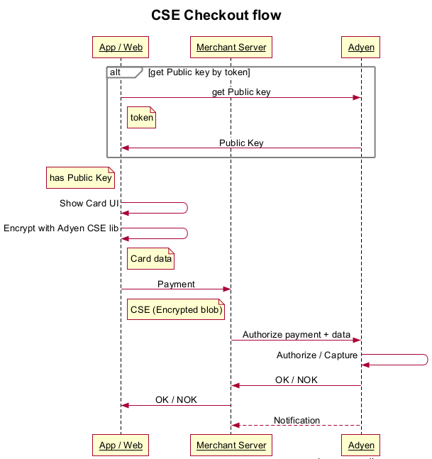

# AdyenCheckout

[](https://travis-ci.org/Adyen/AdyenCheckout)
[](http://cocoapods.org/pods/AdyenCheckout)

## Usage
To run the example project, clone the repo and run `pod install` from the example directory.
You can use the library in two ways:
* Plug & Play
* Advanced.

### Plug & Play example
Provide the token or public key to the library:

``` swift
Checkout.shared.publicKey = "YOUR_ADYEN_PUBLIC_KEY"
// OR
Checkout.shared.token = "YOUR_ADYEN_TOKEN"
```
Show the `CheckoutCardViewController` to checkout with card:

``` swift
// Create payment request
let request = CheckoutRequest()
request.amount = 1.99
request.currency = "EUR"
request.reference = "Merchant Reference 123"

// Create Checkout view controller
let vc = CheckoutCardViewController(checkoutRequest: request)
vc.delegate = self
vc.titleText = "My Company"

// Present the controller
let nc = UINavigationController(rootViewController: vc)
self.presentViewController(nc, animated: true, completion: nil)
```

And implement the `CheckoutViewControllerDelegate` functions:

``` swift
func checkoutViewController(controller: CheckoutViewController, authorizedPayment payment: CheckoutPayment) {
    // Dismiss the view controller
    controller.dismissViewControllerAnimated(true, completion: nil)

    // Send the payment to your server which should validate it with Adyen
    sendPayment(payment) { (psp, error) -> Void in
        if (error != nil) {
            let alert = UIAlertView(title: "Error", message: error!.localizedDescription, delegate: nil, cancelButtonTitle: "OK")
            alert.show()
        } else {
            let alert = UIAlertView(title: "Success!", message: "PSP: \(psp)", delegate: nil, cancelButtonTitle: "OK")
            alert.show()
        }
    }
}

func checkoutViewController(controller: CheckoutViewController, failedWithError error: NSError) {
    // Dismiss the view controller
    controller.dismissViewControllerAnimated(true, completion: nil)

    //Show error
    let alert = UIAlertView(title: "Error", message: error.localizedDescription, delegate: nil, cancelButtonTitle: "OK")
    alert.show()
}
```

The `CheckoutPayment` contains `amount`, `currency`, `reference` and `paymentData` which is Base64 encrypted data.


### More advanced Usage

Take power with the advance library usage. Display the card fields in your view by adding a separate `CardPaymentField` , `UIView` class.

``` swift
let paymentFieldView = CardPaymentField()
self.view.addSubview(paymentFieldView)
```

Ensure that you have a valid public key for encryption, or get it with token:

``` swift
if (Checkout.shared.publicKey == nil) {
    Checkout.shared.fetchPublickKey({ (publicKey, error) -> Void in
        if (error != nil) {
            // Handle error                    
        }
    })
}
```

Encrypt the obtained data:

``` swift
if (paymentFieldView.valid) {
    let card = paymentFieldView.paymentData()
    do {
        let paymentData = try card.serialize()
        let payment = CheckoutPayment(request: self.request, encryptedData: paymentData)
        // Send payment to Adyen
    }
    catch let error as NSError {
        // Handle error
    }
}

```

## Installation
AdyenCheckout is available through [CocoaPods](http://cocoapods.org). To install
add the following line to your Podfile:

```ruby
pod "AdyenCheckout"
```

## Checkout flow



## License
AdyenCheckout is available under the MIT license. See the LICENSE file for more info.
